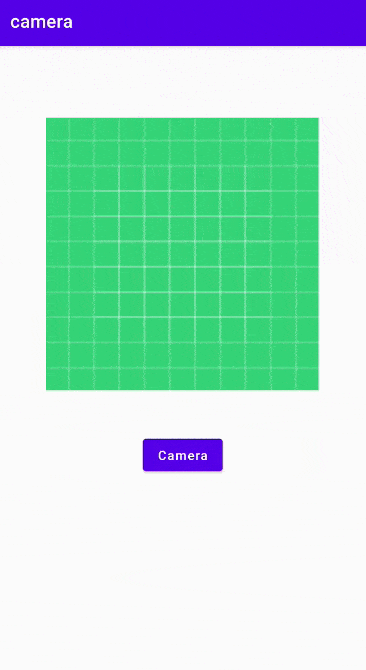

# Take photos 


## Request the camera feature

```xml
<manifest ... >
    <uses-permission android:name="android.permission.CAMERA"/>
    ...
</manifest>
```

## Take a photo with a camera app

```java
public class MainActivity extends AppCompatActivity {

    public static final int CAMERA_PERM_CODE = 101;
    public static final int CAMERA_REQUEST_CODE = 102;
    ImageView selectedImage;
    Button cameraBtn;

    @Override
    protected void onCreate(Bundle savedInstanceState) {
        super.onCreate(savedInstanceState);
        setContentView(R.layout.activity_main);

        selectedImage = findViewById(R.id.displayImageView);
        cameraBtn = findViewById(R.id.cameraBtn);
        // Open Camera
        cameraBtn.setOnClickListener(new View.OnClickListener() {
            @Override
            public void onClick(View v) {
                askCameraPermissions();
            }
        });
    }
    private void askCameraPermissions() {
        if(ContextCompat.checkSelfPermission(this, Manifest.permission.CAMERA) != PackageManager.PERMISSION_GRANTED){
            ActivityCompat.requestPermissions(this,new String[] {Manifest.permission.CAMERA}, CAMERA_PERM_CODE);
        }else {
            openCamera();
        }

    }

    private void openCamera() {
        Intent camera = new Intent(MediaStore.ACTION_IMAGE_CAPTURE);
        startActivityForResult(camera, CAMERA_REQUEST_CODE);
    }
    @Override
    protected void onActivityResult(int requestCode, int resultCode, @Nullable Intent data) {
        super.onActivityResult(requestCode, resultCode, data);
        if(requestCode == CAMERA_REQUEST_CODE){
            Bitmap image = (Bitmap) data.getExtras().get("data");
            selectedImage.setImageBitmap(image);
        }
    }

}
```

## View


```xml
<?xml version="1.0" encoding="utf-8"?>
<androidx.constraintlayout.widget.ConstraintLayout xmlns:android="http://schemas.android.com/apk/res/android"
    xmlns:app="http://schemas.android.com/apk/res-auto"
    xmlns:tools="http://schemas.android.com/tools"
    android:layout_width="match_parent"
    android:layout_height="match_parent"
    tools:context=".MainActivity">

    <TextView
        android:id="@+id/textView"
        android:layout_width="wrap_content"
        android:layout_height="wrap_content"
        android:text="Hello World!"
        app:layout_constraintBottom_toBottomOf="parent"
        app:layout_constraintLeft_toLeftOf="parent"
        app:layout_constraintRight_toRightOf="parent"
        app:layout_constraintTop_toTopOf="parent" />

    <ImageView
        android:id="@+id/displayImageView"
        android:layout_width="300dp"
        android:layout_height="300dp"
        app:layout_constraintBottom_toBottomOf="parent"
        app:layout_constraintEnd_toEndOf="parent"
        app:layout_constraintHorizontal_bias="0.495"
        app:layout_constraintStart_toStartOf="parent"
        app:layout_constraintTop_toTopOf="parent"
        app:layout_constraintVertical_bias="0.199"
        app:srcCompat="@drawable/ic_launcher_background" />

    <Button
        android:id="@+id/cameraBtn"
        android:layout_width="wrap_content"
        android:layout_height="wrap_content"
        android:layout_marginTop="47dp"
        android:text="Camera"
        android:textAllCaps="false"
        app:layout_constraintEnd_toEndOf="parent"
        app:layout_constraintHorizontal_bias="0.5"
        app:layout_constraintStart_toStartOf="parent"
        app:layout_constraintTop_toBottomOf="@+id/displayImageView" />

</androidx.constraintlayout.widget.ConstraintLayout>
```


## Reference
[Android developer](https://developer.android.com/training/camera/photobasics)